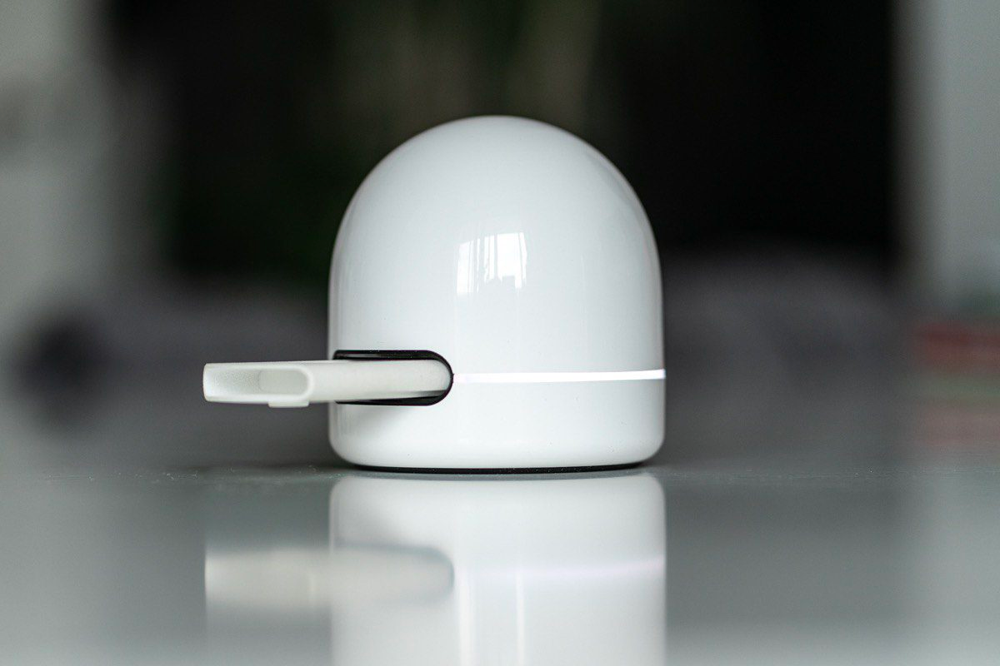

# Health Wallet

HealthWallet is a private silo for your medical records.

## Vision

We build an ecosystem of medical devices that export their data into IPFS. For now we are working together with a hardware startup Dx365 to allow results from DxReader device to be stored in HealthWallet. After this pilot phase we plan to reach out to more startups.

Pharma companies and researchers are also part of an ecosystem. They will get access to the market where they can buy medical data directly from the patients. This way the users will get rewarded for monitoring their health while also helping advance medical research.

## Completed Features

### Patient adds data to HealthWallet

Completed at HackFS 2022
1. On each test cartridge there is a QR-code with its serial number.
2. Patient scans QR-code and the app starts periodically looking into ResultRegistry contract to get the CID of JSON file with the test results.
3. The test is performed.
4. Dx365 uploads its output in JSON format to IPFS via Lighthouse thus ensuring that this data will remain available and publishes a tuple (unique id, output CID) to ResultRegistry contract.
5. HealthWallet downloads results and caches them locally.

## Planned Features

### Patient logs in from a completely new device and get his data back.
- The only method that allows to recover from a complete loss (device + private keys) is Social Recovery so this is the vision.
- The most important piece of information is the list of scanned test serial numbers. Knowing serial numbers will allow HealthWallet to query the ResultRegistry contract and get all the data.
- HealthWallet stores list of test serial numbers internally and also backs it up in IPFS. This backup is a complete medical history of a person and so must be encrypted with Lit Protocol before upload.
- CID of the encrypted backup is then stored in DataAccessToken contract.
- DataAccessToken is similar to NFT and is used as a key for Lit Protocol. It also has one additional property - it can have a set of Guardians. With a majority vote Guardians can transfer DataAccessToken to a new address.